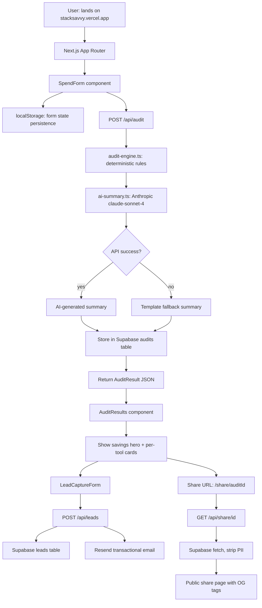

# Architecture

## System Diagram

## Data Flow

1. **Input**: User fills SpendForm (tool, plan, seats, monthly spend × N tools + team size + use case). State saved to `localStorage` on every keystroke.

2. **Audit**: `POST /api/audit` receives `AuditInput`. The `audit-engine.ts` module runs per-tool rule functions (one function per tool, deterministic TypeScript). Returns `ToolRecommendation[]` with savings and reasons.

3. **AI Summary**: `ai-summary.ts` sends the audit output to Anthropic claude-sonnet-4 with a structured prompt asking for a ~100-word personalized paragraph. Falls back to a template string on any API failure.

4. **Storage**: Full `AuditResult` written to Supabase `audits` table. Failure is non-fatal (audit still shown to user).

5. **Display**: `AuditResults` renders the hero savings number, per-tool recommendation cards (with expandable reason), AI summary, and conditional Credex CTA (>$500/mo savings).

6. **Lead capture**: Email submitted to `POST /api/leads` → stored in `leads` table → Resend sends confirmation email with audit link and Credex mention for high-savings cases.

7. **Share URL**: Each audit gets a nanoid-based ID. `/share/[id]` fetches from Supabase, strips email/company from the public view, renders with Next.js `generateMetadata()` for proper OG tags.

## Stack

| Layer | Choice | Why |
|-------|--------|-----|
| Framework | Next.js 14 App Router | SSR for OG tags, API routes, single deploy |
| Language | TypeScript | Type safety on audit logic, catches plan/toolId mismatches at compile time |
| Styling | Tailwind CSS | Rapid iteration, no CSS file maintenance |
| Database | Supabase (Postgres) | Free tier, real SQL, Row Level Security available |
| Email | Resend | Developer-friendly, free tier 3000/mo, excellent deliverability |
| AI | Anthropic claude-sonnet-4 | Best prose quality; we already know the API |
| Deploy | Vercel | Zero-config Next.js, edge functions, free tier |
| Testing | Jest + ts-jest | Native TypeScript, zero config needed |

## Scaling to 10k Audits/Day

Current bottlenecks and fixes at scale:

1. **In-memory rate limiting** → Move to Redis (Upstash on Vercel works at no cost up to ~10k req/day). Rate limit state survives cold starts.

2. **Synchronous AI summary** → Move to background job (Vercel Queue or simple Supabase Edge Function). Return audit immediately, poll for summary. Avoids 3–5s response time under load.

3. **Supabase connection pooling** → Enable PgBouncer in Supabase settings. At 10k audits/day (~7 req/min average, with spikes), connection exhaustion is a risk on the free tier.

4. **OG image generation** → Add `@vercel/og` dynamic image endpoint so share URLs get a real preview image with savings number rendered, not just text tags.

5. **Pricing data freshness** → Replace manual PRICING_DATA.md updates with a weekly cron (Vercel Cron) that checks vendor pages and diffs against stored values, alerting on changes.
